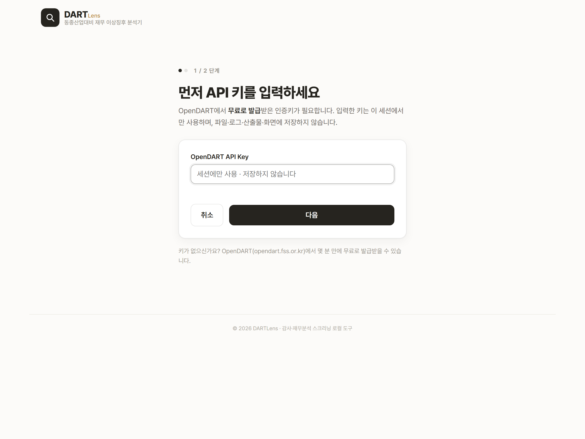

# DARTLens — 동종산업 대비 재무 이상징후 분석기

OpenDART 공시 데이터 기반 · **로컬 Flask 웹 분석 도구**

> 🎬 **데모 영상**: 영상_링크_넣기 _(촬영 후 링크로 교체 예정)_
> 🖥️ **데모**: 별도 호스팅 없이 로컬에서 직접 실행합니다(아래 [2. 실행법](#2-실행법)).
> 🖼️ **화면 예시**: [3. 예시 결과](#3-예시-결과-실제-산출물)에 실제 실행 화면 4장(Flask 웹앱).

---

## 1. 프로그래밍 소개

**회사명(또는 6자리 종목코드)과 사업연도를 입력하면, 대상 기업의 연결재무제표(CFS)를 수집해 16개 재무비율을 계산하고, 동종산업 peer 대비 상대판정(HIGH/LOW/NORMAL)과 산업 무관 절대 기준 red flag(경고/주의)를 함께 표시하는 로컬 분석 도구입니다.**

| 항목 | 내용 |
|---|---|
| 입력 | 회사명(정확일치) 또는 6자리 종목코드 + 사업연도 |
| 데이터 | OpenDART 사업보고서 **연결재무제표(CFS)** + 동종산업(`induty_code` 앞 3자리) 상장 peer |
| 분석 | **16개 재무비율** — ① 동종 peer 대비 **상대판정**(median/IQR, Tukey fence k=1.5, leave-one-out) ② 산업 무관 **절대 red flag**(경고/주의) 병렬 산출 |
| 출력 | 판정·근거·peer 목록이 담긴 **Excel 리포트**(회사별 새 timestamp, 원본까지 역추적) |
| 상대판정 | HIGH · LOW(검토 후보) / NORMAL / INSUFFICIENT_PEERS / NOT_COMPUTABLE / INSUFFICIENT_VARIANCE |
| 절대판정(red flag) | 경고 / 주의 / 정상 / 해당없음 — 회사·산업 무관 절대 기준선 점검(검토 경고이며 위험 확정 아님) |

**분석하는 16개 재무비율**

| 분류 | 개수 | 비율 |
|---|---|---|
| 수익성 | 4 | 영업이익률 · 순이익률 · ROA · ROE |
| 안정성/재무구조 | 5 | 부채비율 · 부채비중 · 유동비율 · 차입금의존도 · **이자보상배율**(영업이익/이자비용) |
| 운전자본/계정리스크 | 4 | 매출채권비율 · 재고자산비율 · 매입채무비율 · 운전자본비율 |
| 회전율 | 3 | 총자산회전율 · 재고자산회전율 · 매출채권회전율 |

### 두 개의 판정 레이어 (상대 + 절대)

1. **상대판정** — 동종산업 peer의 median/IQR과 비교해 HIGH/LOW/NORMAL을 판정한다(peer 대비 상대적 위치).
2. **절대판정(red flag)** — 회사·산업과 무관한 절대 기준선 6종을 병렬로 점검한다:

   | red flag | 기준 | 심각도 |
   |---|---|---|
   | 유동비율 < 1.0 | 유동부채 초과, 단기 지급능력 | 경고 |
   | 운전자본 음수 | 운전자본 잠식 | 경고 |
   | 이자보상배율 < 1.0 | 영업이익으로 이자 미충당 | 경고 |
   | 자본총계 < 0 | 완전 자본잠식 | 경고 |
   | 부채비율 > 400% | 고부채 | 주의 |
   | 영업현금흐름 < 0 & 순이익 > 0 | 이익-현금 괴리 | 주의 |

**왜 필요한가:** 산업 전체가 부실하면 동종 peer **상대비교만으로는 놓친다**. 건설·항공처럼 업계 전반이 고부채·저유동성이면 "peer 대비 정상(NORMAL)"이어도 절대 기준으로는 부실 신호일 수 있다. red flag는 이를 **별도 축**으로 잡는다. 임계값은 `config`에서 조달하며(코드 하드코딩 없음), red flag도 **위험 확정이 아니라 검토 경고·점검 신호**다.

## 2. 실행법

**필요한 것**

- Python 3.10+
- OpenDART API Key **1개** (무료 발급)

**절차**

1. 의존성 설치
   ```bash
   python -m pip install -r requirements.txt
   ```
2. 실행 (둘 중 하나)
   ```bash
   python app_flask.py
   ```
   또는 Windows에서 **`run_app.bat` 더블클릭** (PowerShell: `run_app.ps1`) — 준비되면 브라우저가 자동으로 열립니다.
3. 브라우저에서 콘솔에 표시된 **`http://127.0.0.1:5000`**(포트 사용 중이면 자동으로 다음 빈 포트) 접속 → 랜딩 화면 입력폼에 회사명(또는 6자리 종목코드) · 사업연도 · (선택)API Key 입력 → **[분석 시작하기]**. 기존 산출물은 하단 **[최근 산출물]** 목록에서 결과 보기·Excel 다운로드.

> 로컬 전용 **Flask 웹앱**입니다(외부 배포 서비스 아님, `127.0.0.1`에만 바인딩). 종료는 터미널에서 **Ctrl+C** 또는 창 닫기.

> **기술 스택**: Python · **Flask**(로컬 웹 서버) · Jinja2 템플릿 · 순수 HTML/CSS. 계산 엔진(`src/`)은 표시 layer와 분리되어 있어, 엔진을 **한 줄도 바꾸지 않고** UI만 Streamlit → Flask 로 재구축했습니다(자매 도구들과 동일한 **Flask + HTML** 스택으로 시리즈 통일).

**API 키**

| 환경변수 | 발급처 |
|---|---|
| `OPENDART_API_KEY` | https://opendart.fss.or.kr |

- `.env`의 `OPENDART_API_KEY` 또는 **랜딩 폼 입력**을 사용합니다.
- 폼 입력 키는 **해당 요청 처리 중 세션 한정**으로만 쓰이며 **화면·로그·산출물·파일·서버에 저장하지 않습니다**.
- 실제 API Key와 `.env`는 **저장소에 커밋하지 않습니다**.

## 3. 예시 결과 (실제 산출물)

키 없이도 도구의 동작을 볼 수 있도록, 6개 산업 대표기업을 미리 실행한 **실제 `output/` 산출물**(사업연도 2025)입니다. 아래 수치는 모두 생성된 리포트에서 인용한 실측값입니다. 마지막 열이 **절대판정(red flag)** — 상대판정과 별개 축입니다.

| 회사 | 산업(prefix) | peer(CFS) | 계산 가능 | 상대판정 요약 | 절대판정(red flag) |
|---|---|---|---|---|---|
| 삼성전자 | 전자·반도체(264) | 60 (51) | 15/16 | 전부 NORMAL | 없음 |
| CJ제일제당 | 식품(108) | 33 (31) | 15/16 | 전부 NORMAL | **유동비율<1 · 운전자본 음수 경고** |
| 한화솔루션 | 화학(201) | 49 (42) | 12/16 | 재고자산비율 HIGH 1 · NORMAL 11 | **유동비율<1 · 운전자본 음수 경고** |
| 현대자동차 | 자동차(301) | 3 (3) | 15/16 | peer 부족 → 판정 보류(INSUFFICIENT_PEERS) | 이익-현금 괴리 주의 |
| 대한항공 | 항공(511) | 5 (3) | 13/16 | peer 부족 → 판정 보류 | **유동비율<1 · 운전자본 음수 경고** |
| **태영건설** | **건설(412)** | **14 (12)** | **12/16** | **부채비율 HIGH 1 · NORMAL 11** | **유동비율<1 경고 · 운전자본 음수 경고 · 부채비율 541.95% 주의** |

> **이자보상배율**은 표준 재무제표에 순수 이자비용 라인이 있는 회사(예: 대한항공)만 계산되고, 없으면 NOT_COMPUTABLE입니다(혼합계정 금융비용으로 대체하지 않음). 그래서 대부분 15/16, 대한항공만 13/16입니다. **CJ제일제당·한화솔루션은 상대판정이 대부분 정상이어도 절대 기준으로는 유동성 경고가 잡힙니다** — 상대·절대 두 축이 서로를 보완합니다.

화면 흐름은 **랜딩 → API 키(1/2) → 회사·연도(2/2) → 결과**의 단계형입니다.

**① 랜딩** — 무엇을 하는 도구인지 먼저 보여주고, 입력은 다음 단계로 넘깁니다(로고 좌상단).


**② 입력 1/2 — OpenDART API 키** — 세션에만 사용하고 파일·로그·산출물·화면에 저장하지 않습니다. `.env`에 키가 있으면 이 단계는 자동으로 건너뜁니다.



**③ 입력 2/2 — 회사·연도** — 회사명 또는 6자리 종목코드와 사업연도를 입력합니다. peer가 부족한 산업은 통계 판정을 보류하고 실제 peer와의 참고 비교로 표시합니다.


**④ 결과 — 태영건설 2025** (건설업, peer 14)
건설업 peer 대비로는 **유동비율·운전자본이 "정상 범위"**(상대판정)입니다. 그러나 절대 기준으로는 **유동비율 0.67 < 1 → 경고**, **운전자본 음수(−0.36) → 경고**, **부채비율 541.95% → 주의**가 동시에 잡힙니다.
→ **동종산업 대비로는 평범해도, 절대 기준으로는 부실 신호를 잡는** 장면입니다(red flag는 검토 경고이며 위험 확정이 아닙니다). 위 표의 한화솔루션(재고자산비율 HIGH 1)·현대자동차(peer 부족 → INSUFFICIENT_PEERS 보류) 등 다른 예시도 동일 흐름으로 확인할 수 있습니다.


> 삼성전자는 상대·절대 판정이 모두 깨끗합니다. "전부 NORMAL"은 "안전 확정"이 아니라 **현재 peer universe·IQR 기준에서 이상치로 분류되지 않았다**는 의미이며, CJ제일제당처럼 상대판정이 정상이어도 절대 red flag(유동성 경고)가 잡히는 경우가 있습니다.

## 4. 설계 원칙과 넘은 난관

**설계 원칙 (불변식)**

- **특정회사 하드코딩 금지** — 회사명·종목코드·`corp_code`는 코드가 아니라 입력·`config`·데이터에서 온다. 어떤 회사든 **동일한 코드 경로**를 탄다.
- **CFS 우선 · OFS fallback 금지** — 분석 기준은 연결재무제표(CFS). CFS 조회 실패 시 별도(OFS)로 조용히 대체하지 않고 **중단·기록**한다.
- **`min_peers=5` · 2자리 rollup 금지** — 계산 가능 peer가 5 미만이면 판정을 보류한다. 무관한 업종이 섞이지 않도록 산업 prefix를 2자리로 넓혀 억지로 채우지 않는다.
- **sparse peer 실명 직접비교** — peer가 부족하면 `09_제한적_peer_비교`에 **실제 peer 회사명**으로 직접 비교를 제공한다("Peer 1/2" 익명화 금지).
- **HIGH/LOW는 검토 후보이지 결론이 아님** — 오류·부정·왜곡의 결론이 아니라 추가 검토가 필요한 재무비율이다. 초록/빨강 대신 **주황/파랑/회색**.
- **NOT_COMPUTABLE 은폐 금지** — 계산 불가·peer 부족·CFS 실패·제외 peer를 `08`/`09` 시트에 그대로 표면화한다.
- **계산 layer와 표시 layer 분리** — UI·Excel 표시는 계산 결과(label·median·pool·값)를 바꾸지 않고 **읽기만** 한다.
- **상대판정 + 절대판정 병렬** — 동종 peer 상대비교(HIGH/LOW/NORMAL)와 **산업 무관 절대 기준선(red flag) 6종**을 별도 축으로 함께 표시한다. 산업 전체가 부실하면 상대비교만으로는 놓치기 때문이다. 임계값은 `config`에서 조달하며, red flag도 **위험 확정이 아니라 검토 경고·점검 신호**다.

**넘은 난관**

- **삼성 단일 target 표현의 일반화** — 초기엔 삼성전자 전용 표현(파일명·시트명·"삼성전자 값" 컬럼)이 박혀 있었다. **계산 로직을 건드리지 않고** 대상 회사명으로 파라미터화해, 임의 회사가 같은 경로로 산출물을 생성하게 정리했다.
- **peer 부족 산업 처리** — 항공·자동차처럼 동종 상장사가 적은 산업은 통계 benchmark가 성립하지 않는다. 억지 판정 대신 `INSUFFICIENT_PEERS` + 실명 직접비교로 정직하게 표면화했다.
- **데모가 아닌 실행형 UI 정리** — 전시용 화면이 아니라 입력 → 실행 → 산출물 흐름의 로컬 도구로 정리했다.
- **삼성 하드코딩 게이트 제거** — "분석 실행"이 삼성전자/2025 고정 게이트에 막혀 있던 것을 제거하고, 사용자가 입력한 임의 회사/연도를 pipeline까지 그대로 전달하도록 일반화했다(엔진 계산 **0줄 변경**, 비삼성 신규 분석 산출물 생성으로 검증).
- **절대 red flag 레이어 추가(계산 엔진 불변)** — 상대판정 계산 로직을 **0줄** 바꾸지 않고 절대 기준선 판정을 병렬 레이어로 얹었다(이자보상배율 16번째 비율 포함). 사용자 비율 시트는 핵심 9열로 줄이고 상세 통계는 debug 리포트로 옮겼다.

---

## 문서

- `docs/BUILD_PLAN.md` — MVP 로드맵, 다산업/sparse peer 확장 기록.
- `docs/WEB_UI_PLAN.md` — 로컬 웹 UI 설계·UX 정책(초기 Streamlit → Loop 20 Flask 재구축).
- `docs/DECISIONS.md` — 확정 결정과 미결 질문.
- `references/` — 프로젝트 목표·데이터 모델·분석 방법론·안전 규칙의 정본.

> **목적:** 감사·재무분석에서 "동종산업 대비 특이한 움직임"을 빠르게 선별하기 위한 **스크리닝 보조 도구**입니다. 정상/비정상 이분 판정이 아니라 사람이 추가로 들여다볼 후보를 제시하며, 판단의 한계와 근거를 숨기지 않는 것(auditability)을 최우선으로 둡니다.
