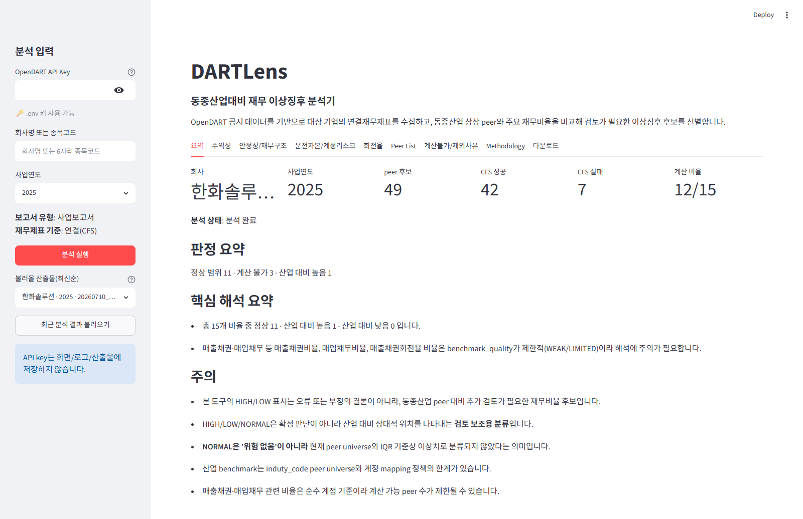
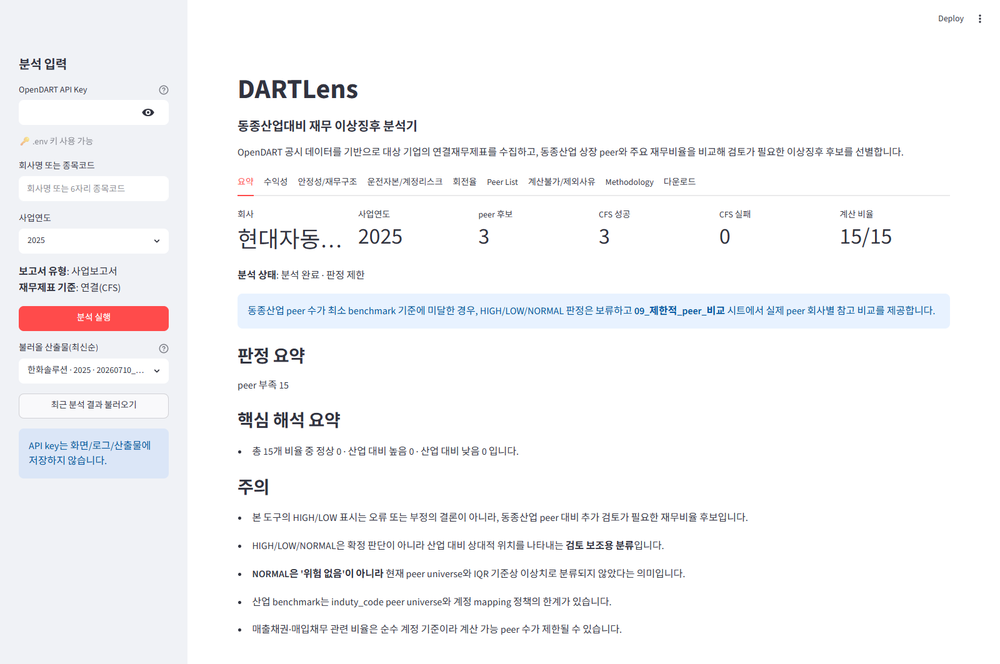

# DARTLens — 동종산업 대비 재무 이상징후 분석기

OpenDART 공시 데이터 기반 · **로컬 Streamlit 분석 도구**

> 🖥️ **데모**: 별도 호스팅 없이 로컬에서 직접 실행합니다(아래 [2. 실행법](#2-실행법)).
> 🖼️ **화면 예시**: [3. 예시 결과](#3-예시-결과-실제-산출물)에 실제 실행 화면 3장.

---

## 1. 프로그래밍 소개

**회사명(또는 6자리 종목코드)과 사업연도를 입력하면, 대상 기업의 연결재무제표(CFS)를 수집해 15개 재무비율을 계산하고 동종산업 상장 peer와 비교해 검토가 필요한 이상징후 후보를 표시하는 로컬 분석 도구입니다.**

| 항목 | 내용 |
|---|---|
| 입력 | 회사명(정확일치) 또는 6자리 종목코드 + 사업연도 |
| 데이터 | OpenDART 사업보고서 **연결재무제표(CFS)** + 동종산업(`induty_code` 앞 3자리) 상장 peer |
| 분석 | 15개 재무비율을 peer **median/IQR** 와 비교 (Tukey fence k=1.5, leave-one-out) |
| 출력 | 판정·근거·peer 목록이 담긴 **Excel 리포트**(회사별 새 timestamp, 원본까지 역추적) |
| 판정 라벨 | HIGH · LOW(검토 후보) / NORMAL / INSUFFICIENT_PEERS / NOT_COMPUTABLE / INSUFFICIENT_VARIANCE |

**분석하는 15개 재무비율**

| 분류 | 개수 | 비율 |
|---|---|---|
| 수익성 | 4 | 영업이익률 · 순이익률 · ROA · ROE |
| 안정성/재무구조 | 4 | 부채비율 · 부채비중 · 유동비율 · 차입금의존도 |
| 운전자본/계정리스크 | 4 | 매출채권비율 · 재고자산비율 · 매입채무비율 · 운전자본비율 |
| 회전율 | 3 | 총자산회전율 · 재고자산회전율 · 매출채권회전율 |

## 2. 실행법

**필요한 것**

- Python 3.10+
- OpenDART API Key **1개** (무료 발급)

**절차**

1. 의존성 설치
   ```bash
   python -m pip install -r requirements.txt
   ```
2. 실행 (둘 중 하나)
   ```bash
   python -m streamlit run app.py
   ```
   또는 Windows에서 **`run_app.bat` 더블클릭** (PowerShell: `run_app.ps1`).
3. 브라우저에서 **`http://localhost:8501`** 접속 → 사이드바에 API Key · 회사명(또는 종목코드) · 사업연도 입력 → **[분석 실행]**. 기존 산출물은 **[최근 분석 결과 불러오기]** 로 확인.

> 로컬에서 직접 구동하는 분석 도구입니다(웹 배포 서비스 아님). 종료는 터미널에서 **Ctrl+C**.

**API 키**

| 환경변수 | 발급처 |
|---|---|
| `OPENDART_API_KEY` | https://opendart.fss.or.kr |

- `.env`의 `OPENDART_API_KEY` 또는 **사이드바 입력**을 사용합니다.
- 사이드바 입력 키는 **현재 세션 메모리에서만** 쓰이며 **화면·로그·산출물·파일에 저장하지 않습니다**.
- 실제 API Key와 `.env`는 **저장소에 커밋하지 않습니다**.

## 3. 예시 결과 (실제 산출물)

키 없이도 도구의 동작을 볼 수 있도록, 5개 산업 대표기업을 미리 실행한 **실제 `output/` 산출물**(사업연도 2025)입니다. 아래 수치는 모두 생성된 리포트에서 인용한 실측값입니다.

| 회사 | 산업(유효 prefix) | peer 후보(CFS 성공) | 계산 가능 비율 | 판정 요약 | 09시트 |
|---|---|---|---|---|---|
| 삼성전자 | 전자·반도체(264) | 60 (51) | 15/15 | 전부 NORMAL | 없음 |
| CJ제일제당 | 식품(108) | 33 (31) | 15/15 | 전부 NORMAL | 없음 |
| 한화솔루션 | 화학(201) | 49 (42) | 12/15 | **재고자산비율 HIGH 1건** · NORMAL 11 · 계산불가 3 | 없음 |
| 현대자동차 | 자동차(301) | 3 (3) | 15/15 | **peer 부족 → 전부 판정 보류(INSUFFICIENT_PEERS)** | 제공 |
| 대한항공 | 항공(511) | 5 (3) | 12/15 | **peer 부족 → 판정 보류** · 계산불가 3 | 제공 |

**① 첫 화면 — 회사·연도 입력** (API Key 칸은 빈 값·마스킹, 저장하지 않음)


**② 검토 후보를 잡아내는 장면 — 한화솔루션 2025**
peer 49개(CFS 성공 42) 중 **재고자산비율만 산업 상단 fence 초과 = HIGH 1건**, 나머지 11개는 NORMAL.
→ 동종산업 대비 특이한 비율을 **검토 후보**로 선별하는 장면입니다.



**③ peer 부족을 정직하게 처리하는 장면 — 현대자동차 2025**
동종 peer가 3개뿐(`min_peers=5` 미만)이라 통계 benchmark가 성립하지 않음.
→ 억지로 HIGH/LOW를 만들지 않고 **INSUFFICIENT_PEERS로 보류**, `09_제한적_peer_비교` 시트에서 **실제 peer 회사명으로 직접 비교**를 제공하는 장면입니다.



> 삼성전자·CJ제일제당은 peer가 충분하고 15개 비율이 전부 NORMAL입니다. 이는 "안전 확정"이 아니라 **현재 peer universe와 IQR 기준에서 이상치로 분류되지 않았다**는 의미입니다.

## 4. 설계 원칙과 넘은 난관

**설계 원칙 (불변식)**

- **특정회사 하드코딩 금지** — 회사명·종목코드·`corp_code`는 코드가 아니라 입력·`config`·데이터에서 온다. 어떤 회사든 **동일한 코드 경로**를 탄다.
- **CFS 우선 · OFS fallback 금지** — 분석 기준은 연결재무제표(CFS). CFS 조회 실패 시 별도(OFS)로 조용히 대체하지 않고 **중단·기록**한다.
- **`min_peers=5` · 2자리 rollup 금지** — 계산 가능 peer가 5 미만이면 판정을 보류한다. 무관한 업종이 섞이지 않도록 산업 prefix를 2자리로 넓혀 억지로 채우지 않는다.
- **sparse peer 실명 직접비교** — peer가 부족하면 `09_제한적_peer_비교`에 **실제 peer 회사명**으로 직접 비교를 제공한다("Peer 1/2" 익명화 금지).
- **HIGH/LOW는 검토 후보이지 결론이 아님** — 오류·부정·왜곡의 결론이 아니라 추가 검토가 필요한 재무비율이다. 초록/빨강 대신 **주황/파랑/회색**.
- **NOT_COMPUTABLE 은폐 금지** — 계산 불가·peer 부족·CFS 실패·제외 peer를 `08`/`09` 시트에 그대로 표면화한다.
- **계산 layer와 표시 layer 분리** — UI·Excel 표시는 계산 결과(label·median·pool·값)를 바꾸지 않고 **읽기만** 한다.

**넘은 난관**

- **삼성 단일 target 표현의 일반화** — 초기엔 삼성전자 전용 표현(파일명·시트명·"삼성전자 값" 컬럼)이 박혀 있었다. **계산 로직을 건드리지 않고** 대상 회사명으로 파라미터화해, 임의 회사가 같은 경로로 산출물을 생성하게 정리했다.
- **peer 부족 산업 처리** — 항공·자동차처럼 동종 상장사가 적은 산업은 통계 benchmark가 성립하지 않는다. 억지 판정 대신 `INSUFFICIENT_PEERS` + 실명 직접비교로 정직하게 표면화했다.
- **데모가 아닌 실행형 UI 정리** — 전시용 화면이 아니라 입력 → 실행 → 산출물 흐름의 로컬 도구로 정리했다.
- **삼성 하드코딩 게이트 제거** — "분석 실행"이 삼성전자/2025 고정 게이트에 막혀 있던 것을 제거하고, 사용자가 입력한 임의 회사/연도를 pipeline까지 그대로 전달하도록 일반화했다(엔진 계산 **0줄 변경**, 비삼성 신규 분석 산출물 생성으로 검증).

---

## 문서

- `docs/BUILD_PLAN.md` — MVP 로드맵, 다산업/sparse peer 확장 기록.
- `docs/WEB_UI_PLAN.md` — 로컬 Streamlit UI 설계·UX 정책.
- `docs/DECISIONS.md` — 확정 결정과 미결 질문.
- `references/` — 프로젝트 목표·데이터 모델·분석 방법론·안전 규칙의 정본.

> **목적:** 감사·재무분석에서 "동종산업 대비 특이한 움직임"을 빠르게 선별하기 위한 **스크리닝 보조 도구**입니다. 정상/비정상 이분 판정이 아니라 사람이 추가로 들여다볼 후보를 제시하며, 판단의 한계와 근거를 숨기지 않는 것(auditability)을 최우선으로 둡니다.
