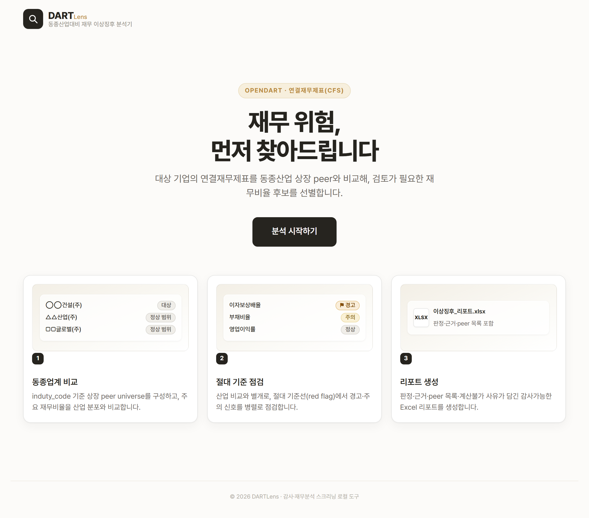
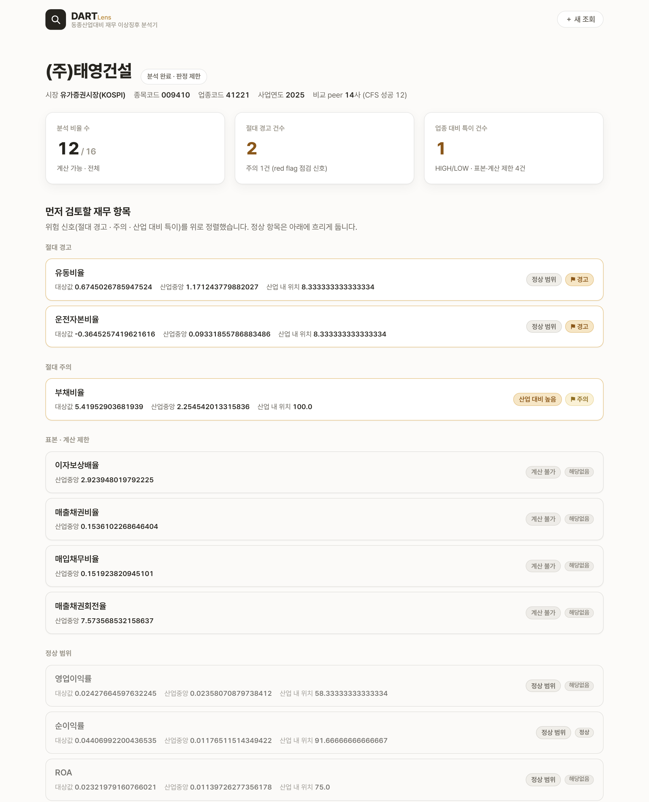

# DARTLens

**회사 이름 하나만 넣으면, 그 회사의 재무비율을 같은 업종 회사들과 비교하고, 업종과 상관없이 위험한 신호까지 함께 짚어 주는 도구입니다.**

## ▶️ 데모 영상


▶️ https://youtu.be/xoSn0q5LXr0

## 이런 도구입니다

감사인은 한 회사의 재무 상태가 정상인지 볼 때, 같은 업종 회사들과 하나하나 비교합니다.

그런데 "정상"의 기준은 업종마다 다릅니다. 건설사의 부채비율과 IT회사의 부채비율을 같은 잣대로 볼 수 없습니다. 그래서 같은 업종 회사들을 일일이 찾아 비교해야 하는데, 이 일은 품이 많이 듭니다. 게다가 업종 전체가 안 좋으면, 그 안에서 평범한 회사는 "정상"처럼 보여 위험을 놓치기 쉽습니다. 건설업이 다 같이 어려우면, 그 안의 부실기업도 "업종 평균쯤"으로 묻혀 버립니다.

이 도구는 그 일을 **네 단계**로 이어 줍니다.

1. 회사 이름으로 **연결재무제표를 자동으로 가져오고**
2. **같은 업종 상장사들과 16개 재무비율을 비교하고**
3. 업종과 상관없이 위험한 **절대 기준을 함께 점검해**
4. **먼저 살펴볼 재무 항목만 추려** 한 화면에 보여 줍니다.

회사명 하나 넣고 기다리면, 흩어져 있던 비교를 한자리에서 끝냅니다.

## 누구에게·왜 필요한가

**이런 분들을 위해 만들었습니다 — 회계법인 감사팀.**
감사계획을 세울 때, 새 고객을 맡을지 검토할 때, 이미 맡은 회사를 계속 지켜볼 때 쓰는 도구입니다.

**감사인이 실제로 겪는 어려움**

- 같은 업종 회사들을 **일일이 찾아 비교**하는 일은 반복적이고 품이 듭니다.
- 업종 전체가 부실하면 **상대 비교만으로는** 그 안의 부실기업을 놓치기 쉽습니다.

**이 도구가 해결하는 방식**
같은 업종 상장사들을 자동으로 모아 16개 재무비율을 비교합니다(**업종 대비**). 동시에, 업종과 무관하게 위험한 절대 기준 — 빚을 갚을 자산이 부족한지, 영업이익으로 이자도 못 내는지 — 을 함께 점검합니다(**절대 기준**). 업종 안에서는 평범해 보여도 그 자체로 위험한 회사를 놓치지 않습니다.

**이렇게 활용합니다**

- **감사계획 전** — 어떤 재무 위험이 있는 회사인지 미리 파악
- **신규 수임 검토** — 새로 맡을 회사의 재무 건전성을 빠르게 조사
- **계속감사 모니터링** — 맡고 있는 회사의 재무 신호를 후속 추적

## 이렇게 나옵니다

회사명 하나를 넣으면 아래처럼 나옵니다.



*랜딩 화면 — 제품 소개와 3단계 흐름, 시작 버튼.*


*입력 화면 — API 키를 넣고 회사명·사업연도를 입력.*



*결과 화면 — 먼저 살펴볼 항목만 추려서 표시. 위험 항목은 우리 회사와 산업을 나란히 비교.*

예를 들어 **태영건설**은 건설업 안에서는 유동비율·운전자본이 "정상 범위"로 보이지만, 절대 기준으로는 **1년 안에 갚을 빚보다 현금화할 자산이 적고, 운전자본이 마이너스**라는 신호가 잡힙니다. 업종 비교만으로는 놓칠 신호를 절대 기준이 잡아내는 사례입니다.

## 신호는 세 가지만 봅니다

재무비율 16개를 살펴본 뒤, 감사인이 **먼저 볼 것만** 세 가지로 추려서 보여 줍니다. 나머지는 특별한 신호가 없는 정상 항목이라 접어 둡니다.

| 신호 | 무슨 뜻인가 |
|---|---|
| **절대 주의** | 업종과 상관없이, 그 자체로 위험한 기준을 넘은 항목 (예: 빚을 갚을 자산 부족) |
| **산업 대비 특이** | 같은 업종 회사들과 비교해 유별나게 높거나 낮은 항목 |
| **판정 불가** | 데이터가 부족해 비교할 수 없는 항목 |

각 항목은 어려운 회계 용어 대신 **한 줄 설명**을 함께 보여 줍니다. "유동비율 0.67배"에는 "1년 안에 갚을 빚보다 현금화할 자산이 적음"처럼요.

## 다루는 16개 재무비율

| 분류 | 비율 |
|---|---|
| 수익성 | 영업이익률 · 순이익률 · ROA · ROE |
| 안정성 | 부채비율 · 부채비중 · 유동비율 · 차입금의존도 · 이자보상배율 |
| 운전자본 | 매출채권비율 · 재고자산비율 · 매입채무비율 · 운전자본비율 |
| 회전율 | 총자산회전율 · 재고자산회전율 · 매출채권회전율 |

**연결재무제표(연결)만 다룹니다.** 연결을 제출하지 않는 회사는 억지로 처리하지 않고 깔끔하게 끝냅니다.

## 실행 방법

필요한 것: **Python 3**, 그리고 **API 키 1개**(아래 발급처 참고).

```
1) (최초 1회) pip install -r requirements.txt
2) run_app.bat  더블클릭              ← Windows
   python app_flask.py               ← 공통
3) 브라우저가 http://127.0.0.1:5000 을 자동으로 엽니다
4) 화면에서 API 키 입력 → 회사명·사업연도 입력 → 결과 확인
```

> **이 도구는 내 PC에서 돌아갑니다.** `run_app.bat`을 더블클릭하면 실행 창이 하나 열리고, 잠시 뒤 브라우저가 자동으로 열립니다. **쓰는 동안 이 실행 창을 닫지 마세요 — 이 창이 서버를 유지합니다.** 다 쓴 뒤 창을 닫으면 서버가 꺼집니다.

**API 키 1개가 필요합니다.** Open DART 인증키는 **무료**로 발급받습니다.

| 키 | 발급처 |
|---|---|
| `OPENDART_API_KEY` | https://opendart.fss.or.kr (오픈다트 인증키) |

> 키는 **화면에서 입력**하며, 이 PC의 메모리에만 잠깐 머물다 서버를 끄면 사라집니다. 파일이나 기록에 저장하지 않고, 내 PC 안에서만 돌아 밖으로 나가지 않습니다. (키 이름만 담긴 `.env.example`을 참고하세요.)

## 이 도구가 신경 쓴 것

만들면서 특히 공들인 네 가지입니다.

**1. 업종 비교만 믿지 않습니다.**
업종 전체가 부실하면 상대 비교로는 위험을 놓칩니다. 그래서 업종과 무관한 절대 기준을 따로 둡니다. 태영건설처럼 건설업 안에서는 평범해 보여도, 절대 기준으로는 위험 신호가 잡힙니다. 업종 평균에 묻히는 부실을 잡아내는 것이 이 도구의 핵심입니다.

**2. 계정을 억지로 갖다 붙이지 않습니다.**
"매출채권"을 계산할 때 "매출채권및기타채권" 같은 혼합계정으로 대충 채우지 않습니다. 이자비용도 "금융비용" 덩어리로 뭉뚱그리지 않고 순수 이자비용만 씁니다. 매핑이 애매하면 차라리 **"판정 불가"**로 정직하게 표시합니다. 없는 값을 지어내지 않습니다.

**3. 비교할 회사가 부족하면 억지 판정하지 않습니다.**
자동차·항공처럼 상장 동종업체가 몇 곳뿐인 산업은, 소수만으로 산업 평균을 내면 그 기준 자체를 믿을 수 없습니다. 회사 한두 곳의 값에 평균이 휘둘리기 때문입니다. 이럴 때(동종업체 5곳 미만) 억지로 순위를 매기지 않고, **실제 동종업체의 이름을 그대로 보여 주며** 회사 대 회사로 직접 비교합니다. 감사인이 어떤 회사와 비교됐는지 직접 확인할 수 있어야 하기 때문입니다.

**4. "위험 확정"이라고 말하지 않습니다.**
이 도구가 표시하는 건 결론이 아니라 **"먼저 살펴볼 항목"**입니다. 절대 주의도, 산업 대비 특이도, 모두 감사인이 검토할 신호이지 위험 확정이 아닙니다. 최종 판단은 감사인의 몫입니다.

---
_개발자용 안내는 `docs/` 폴더를, 설계 원칙과 반복 개선 과정은 `harness/` 폴더를 참고하세요. 감사·재무분석 실무 보조 목적의 로컬 실행 도구입니다._
